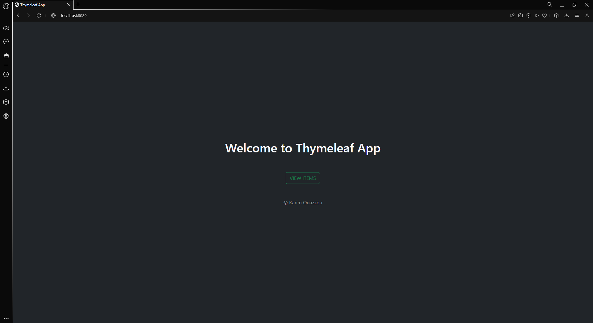
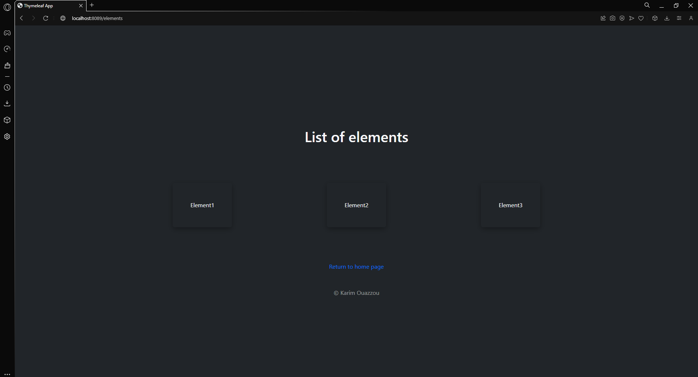
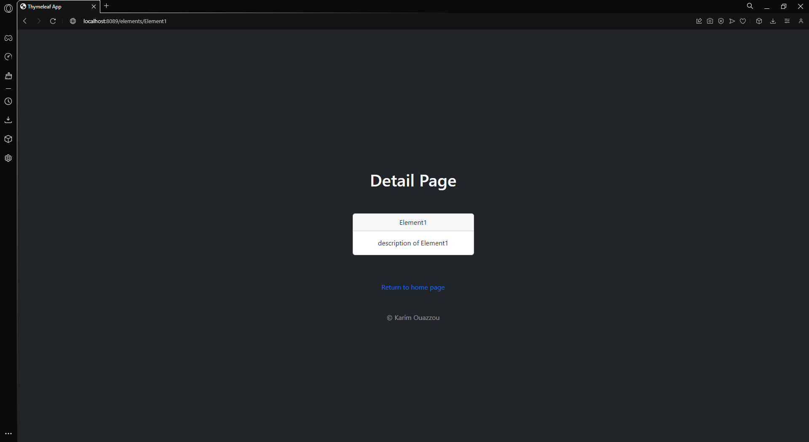
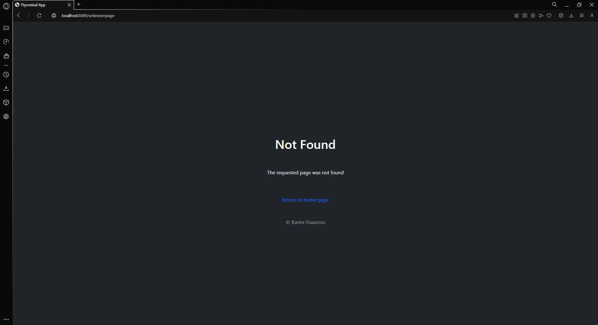

<h3 align="center">Practical Exercise</h3>

## About The Project
Spring Boot Project with the usage of Thymeleaf

## Tools and technologies used
• Java 17 • Maven • Spring Boot 3 • Spring Web • Spring Boot DevTools • Thymeleaf • Bootstrap •

## Preview
- Home page

- List of elements

- Description of element

- Not found page

